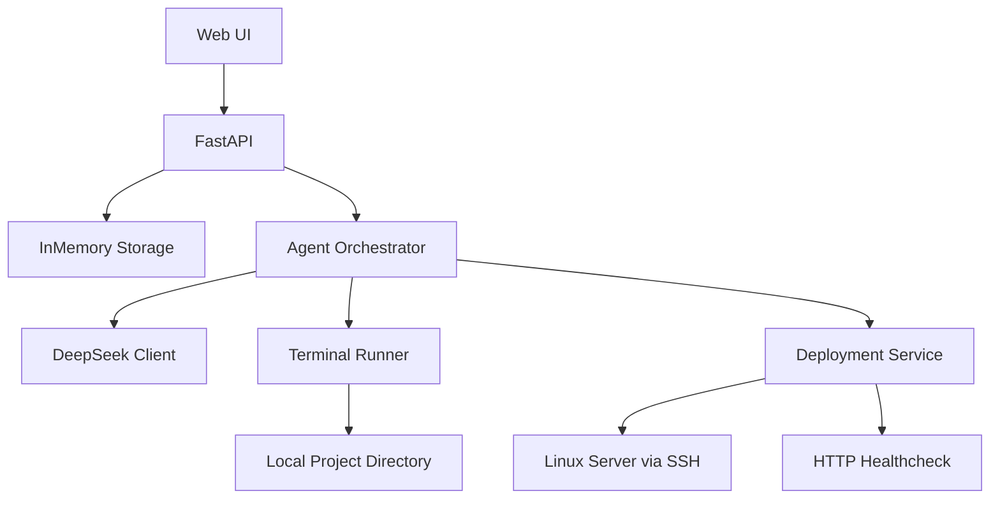
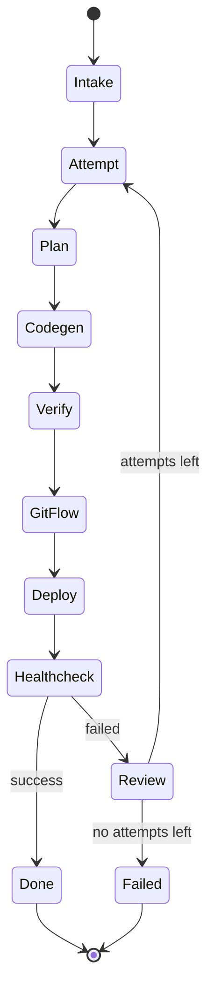
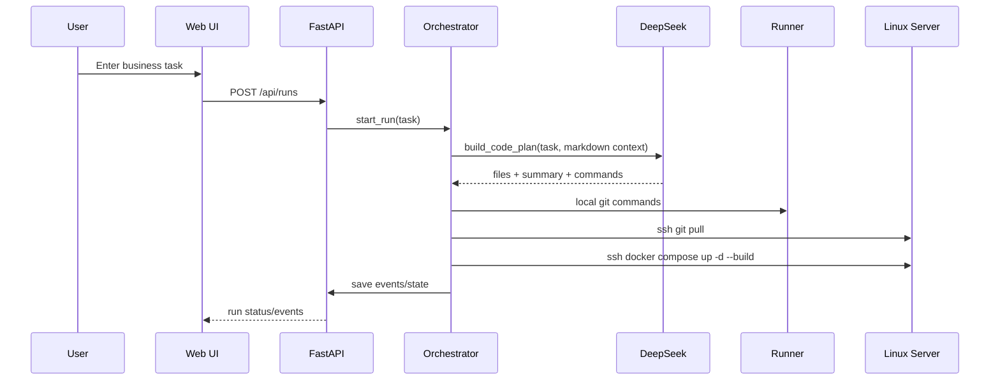

# Agentic Architecture

## High-level flow

## Retry loop

## Sequence

## Environment variables

- `DEEPSEEK_API_KEY`: API key for planner/reviewer calls
- `LINUX_HOST`, `LINUX_USERNAME`, `LINUX_PASSWORD`: remote deploy access
- `DEPLOY_PROJECT_DIR`: server directory where docker compose runs
- `LOCAL_PROJECT_DIR`: local project where generated files are materialized
- `AUTO_GIT_PUSH`: optional automatic push after commit
- `AUTO_DEPLOY`: toggle remote deploy stage
- `MAX_FIX_ATTEMPTS`: retry loop length
